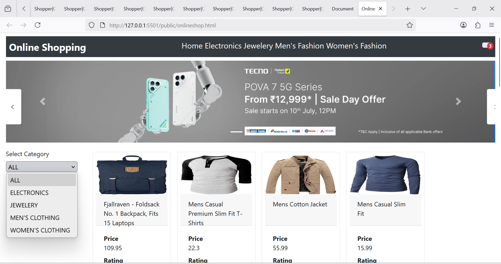

# 🛍️ Online Shopping Demo

A front-end e-commerce showcase built with HTML, JavaScript, and Bootstrap 4. Uses FakeStoreAPI for product data.
      
      
## ✅ Key Features

- **Dynamic Category Filtering:** Fetches categories and products; filter via dropdown or nav links.
- **Product Cards:** Displays product image, title, price, rating in Bootstrap cards.
- **In-Memory Cart:** Add items → updates badge count; view cart summary in modal list.
- **Modal Cart UI:** Cart preview with thumbnail and price, easily extendable.
